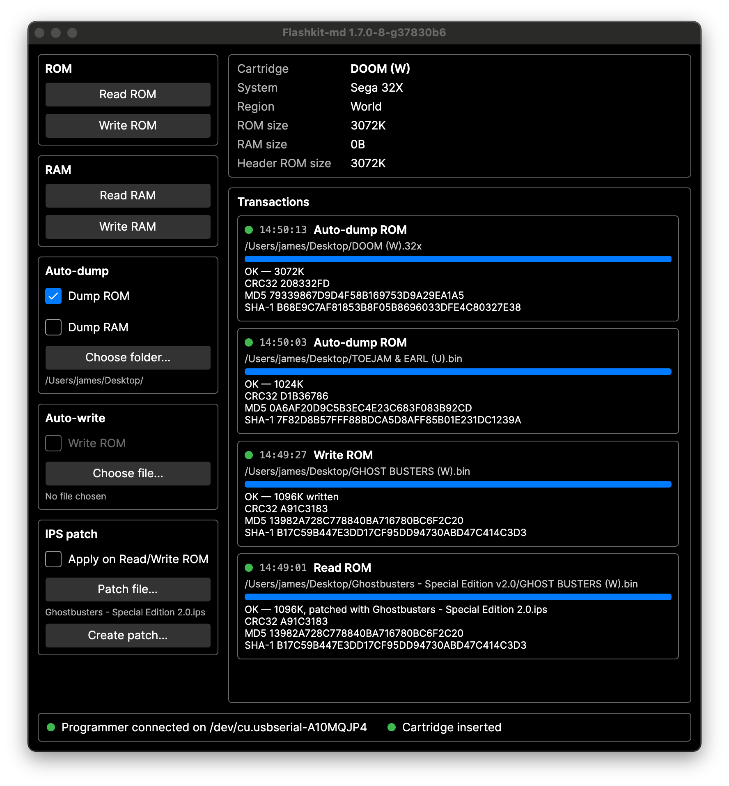

# flashkit-md-dotnet

Cross-platform (Linux / macOS / Windows) client for
[krikzz's FlashKit MD programmer](https://krikzz.com/our-products/accessories/flashkitmd.html)
— dump and flash Sega Mega Drive / Genesis cartridges. Ships as a desktop
GUI (`flashkit-md-gui`), a terminal UI (`flashkit-md-tui`), and a CLI
(`flashkit-md`).



> **All credit for the hardware and the original client goes to
> [krikzz](https://krikzz.com/)** — this project is a port of the original
> Windows-only client and would not exist without that work. Original C#
> client and hardware sources:
> [github.com/krikzz/flashkit](https://github.com/krikzz/flashkit) (MIT).
> Buy the programmer from
> [krikzz.com](https://krikzz.com/our-products/accessories/flashkitmd.html).

## Install

Download the latest release from the
[Releases page](https://github.com/jfryman/flashkit-md-dotnet/releases)
(every release includes a `SHA256SUMS` file). All builds are
self-contained — no .NET runtime or other dependencies to install.

### macOS

Download `FlashKit-MD.app-vX.Y.Z-osx-arm64.zip` (Apple Silicon) or
`...-osx-x64.zip` (Intel), unzip, and drag `FlashKit MD.app` to
Applications. If macOS reports the app as damaged or from an unidentified
developer on first launch, right-click → Open, or clear the download
quarantine:

```
xattr -dr com.apple.quarantine "/Applications/FlashKit MD.app"
```

The CLI ships in `flashkit-md-vX.Y.Z-osx-{arm64,x64}.tar.gz` alongside a
bare GUI binary; the same quarantine note applies
(`xattr -d com.apple.quarantine ./flashkit-md`).

### Linux

**Flatpak** (x86_64, arm64): download
`flashkit-md-vX.Y.Z-linux-{x64,arm64}.flatpak` for your architecture and

```
flatpak install ./flashkit-md-vX.Y.Z-linux-x64.flatpak
flatpak run io.github.jfryman.FlashKitMD
```

`flatpak run` starts the GUI; the TUI and CLI ride along in the same
bundle:

```
flatpak run --command=flashkit-md-tui io.github.jfryman.FlashKitMD
flatpak run --command=flashkit-md io.github.jfryman.FlashKitMD info
```

**Tarball** (x86_64, arm64): `flashkit-md-vX.Y.Z-linux-{x64,arm64}.tar.gz`
holds the `flashkit-md` CLI, `flashkit-md-gui`, and `flashkit-md-tui`
binaries — untar and run.

Either way, your user needs access to the programmer's serial port. If you
get "Access to the port ... is denied", add yourself to the serial group
and log out and back in:

```
sudo usermod -aG dialout $USER   # Debian/Ubuntu/Fedora
sudo usermod -aG uucp $USER      # Arch
```

or install the udev rule in
[`packaging/99-flashkit-md.rules`](packaging/99-flashkit-md.rules).

### Windows

Download `flashkit-md-vX.Y.Z-win-x64.zip` and unzip; run
`flashkit-md-gui.exe` (GUI) or `flashkit-md.exe` (CLI). If SmartScreen
warns about an unrecognized app, choose "More info" → "Run anyway".

## Using the TUI

`flashkit-md-tui` is the GUI's terminal sibling for SSH sessions and
keyboard-first workflows: the same live device/cartridge status, cart info
panel, transaction log, and auto-dump/auto-write panels, rendered with
[Terminal.Gui](https://github.com/tui-cs/Terminal.Gui). Tab moves between
controls, Enter activates, and file prompts open an in-terminal browser.

## Using the GUI

Plug in the programmer and start the GUI — the status bar along the bottom
shows when the programmer is detected (and on which port) and whether a
cartridge is seated. Cart details refresh automatically every couple of
seconds; every operation appears in the transaction log with its own
progress bar and result (size and MD5, or the error).

- **Read/Write ROM, Read/Write RAM** — the classic per-file operations,
  with a file picker named after the cart's header.
- **Auto-dump** — tick *Dump ROM* (and optionally *Dump RAM*), pick a
  folder, and every cartridge you insert is dumped there automatically,
  named after its header. Existing files are never overwritten (a " (2)"
  suffix is added).
- **Auto-write** — for flash-cart development loops: pick a ROM image and
  every flash cart you insert is erased and reprogrammed with it.
  Destructive by design, so it asks for confirmation when enabled;
  cartridges without a writable flash chip (retail games) are detected
  and skipped. Auto-dump and auto-write cannot be enabled together.

## Using the CLI

```
flashkit-md [--port <serial-port>] <command> [file]

  info               print cart ROM name/size and save-RAM size
  read-rom [file]    dump cart ROM (default file: <ROM name>.bin)
      --trust-header dump the size the ROM header declares, not the
                     mirror-probed size (useful on flash carts)
  write-rom <file>   erase flash cart and write ROM image
      --full-erase   wipe the whole 4 MB chip first (see notes below)
      --no-flash-check   skip the CFI flash-presence check run before
                     erasing (also applies to bake-save)
  read-ram [file]    dump save RAM (default file: <ROM name>.srm)
  write-ram <file>   write save RAM from file
  bake-save <file>   program a save snapshot into flash (see notes below)

flashkit-md --version   print the build's version
```

The programmer is auto-detected by probing likely USB serial ports
(`/dev/ttyACM*`/`/dev/ttyUSB*` on Linux, `/dev/cu.usbmodem*`/`/dev/cu.usbserial*`
on macOS, `COM*` on Windows). Use `--port` to pin a specific port.

Dumps print an MD5 you can compare against the original Windows client's
output; `write-rom` and `write-ram` verify by reading back.

## Notes on flash carts

`write-rom` erases only as much flash as the image needs (matching the
original client). If the cart previously held a larger ROM, the leftover
data above the new image stays on the chip — and a game with save support
may read it through the save-RAM window at `0x200000` and show "corrupted"
ghost save slots on console. Use `write-rom --full-erase` to wipe the whole
chip first (only on carts with a full-size 4 MB chip — on smaller chips the
upper address space mirrors the ROM and a full erase would corrupt it).

The FlashKit cart plays saves-capable games but cannot persist saves unless
its board actually has SRAM populated; `info` reporting `RAM size : 0B` on
the flash cart tells you saving won't work. As a workaround, `bake-save`
programs a save image (e.g. dumped from a real cart with `read-ram`) into
the flash at the save window: the game then sees those saves — loadable,
surviving every power cycle — but as a read-only snapshot it cannot
overwrite in-game.

## Building from source / contributing

See [DEVELOPING.md](DEVELOPING.md).

## Credits and license

The FlashKit MD hardware and the original client are by
[krikzz](https://krikzz.com/) and published at
[github.com/krikzz/flashkit](https://github.com/krikzz/flashkit) under the
MIT license. This port is likewise MIT-licensed
(see [`LICENSE`](LICENSE)), retaining krikzz's copyright notice.

Thanks also to [joeyparrish/flashkit-md-py](https://github.com/joeyparrish/flashkit-md-py),
an independent Python port of the same client.
